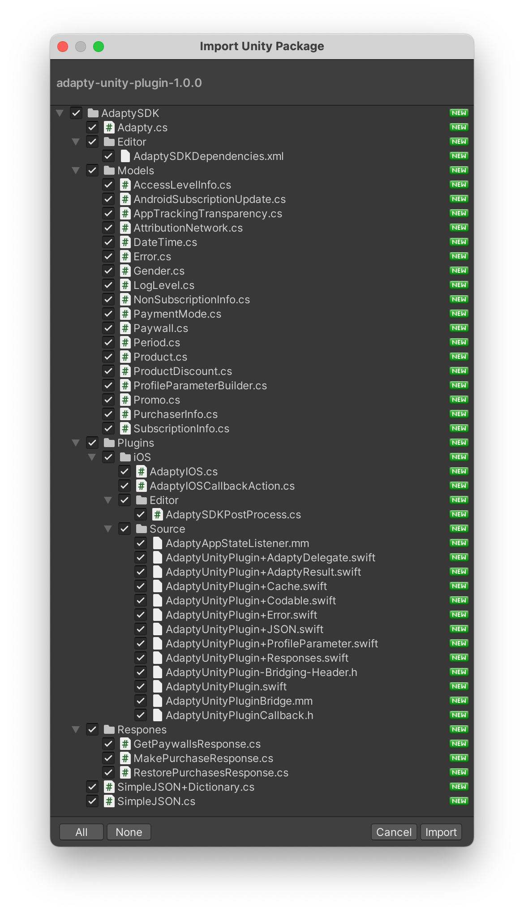

# Installation

To install the SDK you can either find it in the Asset Store or you can download from github `adapty-unity-plugin-*.unitypackage` and import it into your project. Please also download and import the [External Dependency Manager plugin](https://github.com/googlesamples/unity-jar-resolver).

The SDK uses the "External Dependency Manager" plugin to handle iOS Cocoapods dependencies and Android gradle dependencies. After the installation you may need to invoke the dependency manager

`Assets -> External Dependency Manager -> Android Resolver -> Force Resolve`

and

`Assets -> External Dependency Manager -> iOS Resolver -> Install Cocoapods`

When building your Unity project for iOS, you would get `Unity-iPhone.xcworkspace` file, which you have to open instead of `Unity-iPhone.xcodeproj`, otherwise Cocoapods dependencies won't be used.
